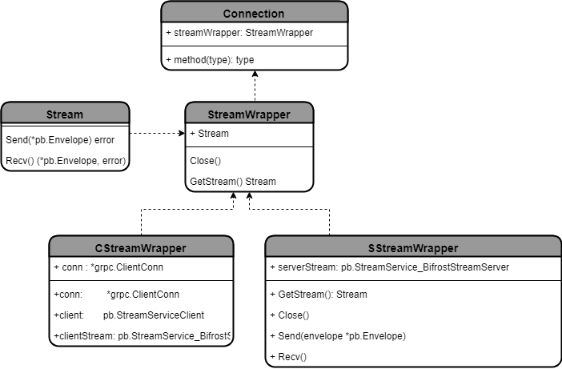

# Bifrost
[](https://travis-ci.org/it-chain/bifrost)
[](https://opensource.org/licenses/Apache-2.0)
[](https://golang.org)
[](https://coveralls.io/github/it-chain/bifrost?branch=master)

<p align="center"></p>


Bifrost is a grpc-based P2P network library

(In Norse mythology, Bifröst is a burning rainbow bridge that reaches between Midgard and Asgard, the realm of the gods.)
## Getting Started with Bifrost

### Installation

```
go get -u github.com/it-chain/bifrost
```

### Usage


**Server**
```Go
import (
  "github.com/it-chain/bifrost/pb"
	"github.com/it-chain/bifrost/server"
)

// connection control
ConnectionStore := bifrost.NewConnectionStore()

// server listen
s := server.New(bifrost.KeyOpts{PriKey: priKey, PubKey: pubKey})
server.Listen(_gRPCatewayIP_)
```

**Client**
```Go
import (
  "github.com/it-chain/bifrost/client"
)
connection, err := client.Dial(command.Address, clientOpt, grpcOpt) //흔히 cli 에서 이루어짐
connection.send(payload []byte, protocol string, successCallBack func(interface{}), errCallBack func(error)) //connection GrpcConnection
```

## Document
### process buffer
bifrost 가 grpc 서비스를 구축하기 위해 stream.proto file 을 작성하였으며, 이는 protoc 에 의해 compile 되어 go 코드로 변환된다.
stream.proto file 에 대해 간단히 소개하자면 StreamService 라는 구조체를 기반으로 BifrostStream이라는 함수를 가지며, Envelope 라는 자료형을 추가로 구성한다.

서버측에서 `RegisterStreamServiceServer` 를 통해 서버를 등록하고 클라이언트 측에서 `NewStreamServiceClient` 를 통해 streamServiceClient 객체를 생성하고, `streamServiceClient.BifrostStream` 을 호출하는 방식으로 Envelop 를 송수신 한다.

### data structure

## Lincese

Bifrost source code files are made available under the Apache License, Version 2.0 (Apache-2.0), located in the [LICENSE](LICENSE) file.
